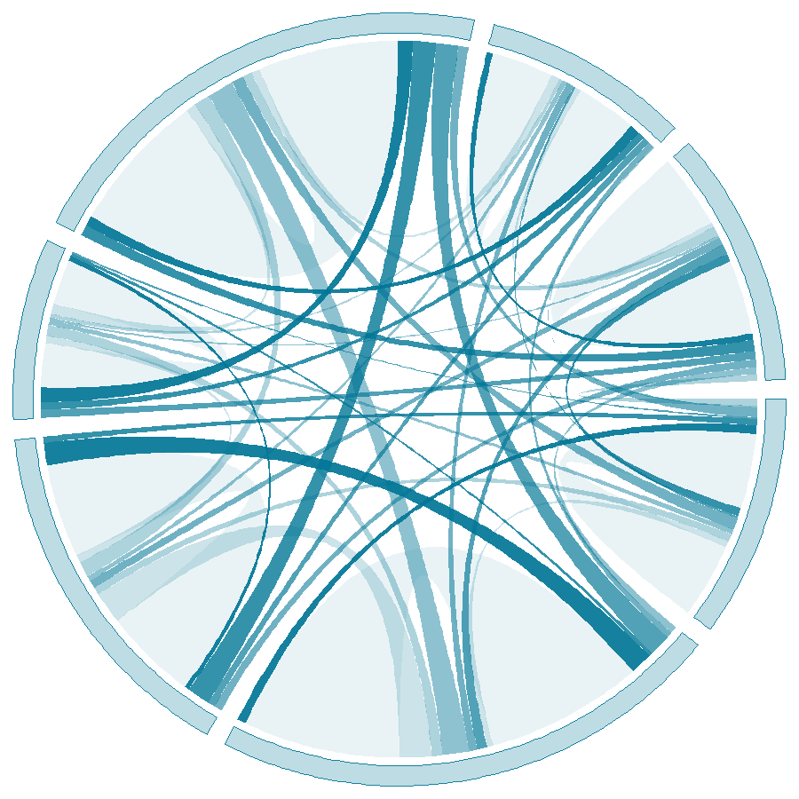

```{r setup, include=FALSE}
## Save package names as a vector of strings
pkgs <-
  c("rmarkdown",
    "knitr",
    "dplyr",
    "devtools",
    "widgetframe",
    "RefManageR",
    "bibtex",
    "plotly")

## Install uninstalled packages
lapply(pkgs[!(pkgs %in% installed.packages())], install.packages)

## Load all packages to library and adjust options
lapply(pkgs, library, character.only = TRUE)

## Devtools install
if (!("icon" %in% installed.packages()))
  devtools::install_github("ropenscilabs/icon")
library(icon)

## Global chunk options
knitr::opts_chunk$set(echo = FALSE,
                      warning = FALSE,
                      message = FALSE)
options(scipen=999)
options(htmltools.dir.version = FALSE)

## RefManageR options
BibOptions(
  bib.style = "authoryear",
  hyperlink = "to.bib",
  style = "markdown",
  max.names = 3L
)
```

class: inverse, mline, center, middle

# Key Facts

---

# What is the MZES Xaringan Metropolis Theme?

- This theme, inspired by the MZES corporate design, is a customization of the popular [`metropolis`](https://github.com/matze/mtheme) theme for [`xaringan`](https://bookdown.org/yihui/rmarkdown/xaringan.html), an R package for generating interactive HTML5 slides using [RMarkdown](https://bookdown.org/yihui/rmarkdown/).
- It relies on:

    - [xaringan](https://github.com/yihui/xaringan), developed by Yihui Xie at RStudio,
    - [Patrick Schratz](https://github.com/pat-s/xaringan-metropolis)' and [Danilo Freire](https://github.com/danilofreire/xaringan-metropolis)'s adaptations of the `metropolis` theme for `xaringan`, and
    - [Garrik Aden-Buie](https://www.garrickadenbuie.com/blog/xaringan-tip-logo-all-slides/)'s `insert-logo.html` add-on.
    
- A matching MZES Beamer Metropolis Theme is available [here](https://github.com/denis-cohen/mzes-beamer-metropolis/).

---

# MZES Xaringan Metropolis vs MZES Beamer Metropolis

### Similarities

- Both themes use MZES corporate colors.
- Both feature title slides with full contact and social media information for multiple authors.
- Both embed the MZES Logo on the first slide.
- Both use the 16:9 aspect ratio (instead of 4:3), the default on most projectors and screens nowadays.
- Both allow for emphases in .cyan[MZES cyan] and .gold[MZES gold].
---

# MZES Xaringan Metropolis vs MZES Beamer Metropolis

### Differences

- Beamer produces static PDF slides, Xaringan produces dynamic, interactive HTML5 slides.
- Beamer slides are written in LaTeX, Xaringan slides are written in RMarkdown.
- Unlike Beamer, Xaringan allows for R code to be evaluated while knitting the code and for (interactive) R output to be directly embedded in the presentation.
- Unlike the Beamer Theme, the Xaringan Theme does not support a permanent footer.
- Unlike the Beamer Theme, the Xaringan Theme does not support progress bars on section title slides. Progress bars are only displayed underneath the slide title.
- The Xaringan Theme does not support the Beamer Theme's custom blocks, though equivalent classes can be defined in `mtheme.css`.
- The Xaringan Theme does not support the Beamer Theme's optional custom citation commands.
- Whereas Beamer directly supports BibTeX references, Xaringan requires a little [work-around](https://github.com/yihui/xaringan/wiki/Bibliography-and-citations) using the R package [`RefManageR`](https://cran.r-project.org/web/packages/RefManageR/index.html). 

---
class: inverse, middle, mline, center
# Cool Features

---

# Code highlighting

The MZES Xaringan Metropolis Theme supports inline code highlighting in MZES cyan and line-wise code chunk highlighting in (shades of) MZES gold.

#### Inline code highlighting

Here is an example of inlight code highlighting for some R code: `N <- 1000L`.

#### Line-wise code chunk/output highlighting

Suppose `N <- 1000L` is really important in a function:

```r
if (TRUE) {
* N <- 1000L
  mu <- 4.0
  sigma <- 2.0
  rnorm(N, mu, sigma)
}
```

---

# MathJax and Block Quotes

The MZES Xaringan Metropolis Theme by defaults highlights MathJax expressions in the MZES gold color.


#### MathJax

$$y = \alpha + \beta x + \epsilon$$

where $\alpha$ is the intercept, $\beta$ is the slope, and $\epsilon$ is an idiosyncratic error term.

#### Block quotes

Block quotes use a shading of .cyan[MZES cyan], too. By default, they are displayed at 75% of the original font size.

<blockquote>
  "Lorem ipsum dolor sit amet, consectetur adipiscing elit, sed do eiusmod tempor incididunt ut labore et dolore magna aliqua. Ut enim ad minim veniam, quis nostrud exercitation ullamco laboris nisi ut aliquip ex ea commodo consequat. Duis aute irure dolor in reprehenderit in voluptate velit esse cillum dolore eu fugiat nulla pariatur. Excepteur sint occaecat cupidatat non proident, sunt in culpa qui officia deserunt mollit anim id est laborum."
</blockquote>

---

# Flexible use of side bars

.left-column[ 
## Findings
A Chord Diagram
]

.right-column[
```{r, out.width = "50%", fig.align='center', fig.cap='Fig. 1: Voter transitions turned into a blog logo'}

```
]

---

# Citations using `RefManageR`

```{r, warning = FALSE, message = FALSE}
file <- system.file("Bib", "biblatexExamples.bib", package = "RefManageR")
bib <- ReadBib(file, check = "error")
```

Citations can be inserted using `RefManageR`. After converting the sample file `biblatexExamples.bib` as an R object `bib`, we can cite in-text via `Citet(bib, "cicero")` or in parentheses using `Citep(bib, "nietzsche:ksa")`. 

Effectively, this will look like this: We first cite `r Citet(bib, "cicero")` in text and then `r Citep(bib, "nietzsche:ksa")` in parentheses. We can then print the bibliography using `PrintBibliography(bib)` inside an R code chunk with the option `results='asis'`.

#### References
.font75[
```{r bib-print, results='asis', echo=FALSE}
## Set bibliography options
BibOptions(
  bib.style = "authoryear",
  first.inits = FALSE,
  dashed = TRUE,
  sorting = "nyt",
  no.print.fields = c("doi", "url", "isbn", "issn"),
  style = "text",
  max.names = 15L,
  hyperlink = FALSE
)

## Print bibliography
PrintBibliography(bib)
```
]

---

# Interactive R-generated HTML Widgets

```{r}
dat <- data.frame(
  sen = c(rep("pp", 3), rep ("tex", 3), rep("xar", 3)),
  rec = rep(c("pp", "tex", "xar"), 3),
  n = c(20, 25, 10, 2, 13, 15, 1, 1, 13)
)

# Sankey diagram using plotly
labels <- rep(c("PowerPoint", "Beamer", "xaringan"), 2L)
colors <- rep(c("#d04423", "#008181", "#DC2D37"), 2L)
plot_ly(
  type = "sankey",
  orientation = "h",
  node = list(
    label = labels,
    color = colors,
    pad = 15,
    thickness = 15,
    line = list(color = "black",
                width = 0.5)
  ),
  link = list(
    source = as.numeric(as.factor(dat$sen)) - 1L,
    target = as.numeric(as.factor(dat$rec)) + 2L,
    value =  dat$n
  ),
  height = 576,
  width = 1000
) %>%
  layout(font = list(size = 10))
```

---

# Embedding ShinyApps
<p align="center">
  <iframe width="900" height="480" src="https://kgavras.shinyapps.io/Shiny_Development_Deployment/" frameborder="0" allow="accelerometer; autoplay; encrypted-media; gyroscope; picture-in-picture" allowfullscreen></iframe>
<br>  
.font75[*Note:* App by [Konstantin Gavras](https://kgavras.shinyapps.io/Shiny_Development_Deployment/). See the corresponding blog post on [Methods Bites](https://www.mzes.uni-mannheim.de/socialsciencedatalab/article/shiny-apps/)].
</p>
